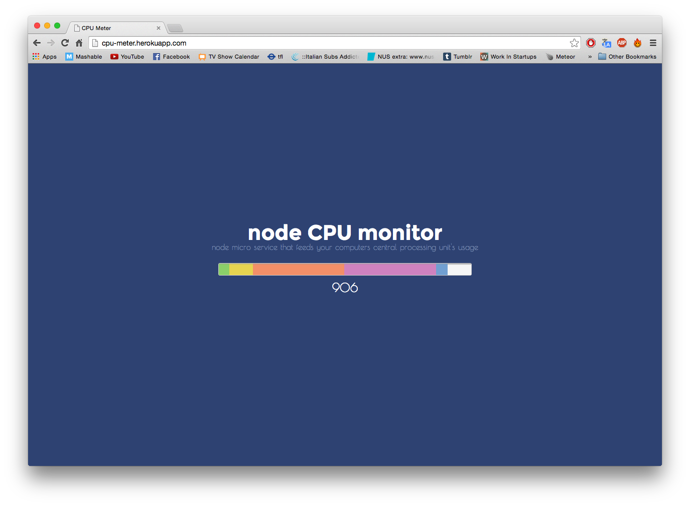

[](https://codeclimate.com/github/elenagarrone/cpu_meter)

CPU Meter
=========

This is a cpu monitor built together with Bernard using node.js, socket.io and a module called os-monitor.
We created a 'redable stream' and then piped this down to the browser through a socket.
The meter is moving up and down reporting the CPU usage.



Technologies:
-------------
- JavaScript
- Node.js
- CSS/HTML
- JQuery
- Socket.io
- os-monitor
- Express.js

On Heroku:
----------
http://cpu-meter.herokuapp.com/

How to use:
-----------
Clone the repo:
```shell
$ git clone https://github.com/elenagarrone/cpu_meter.git
```
Change into the directory:
```shell
$ cd cpu_meter
```
Supposing you have installed Node.js and npm, type:
```shell
$ npm install
# this will install the packages inside of the package.json file
```
and then:
```shell
$ npm start
#then on the browser go to:
localhost:3000
```
